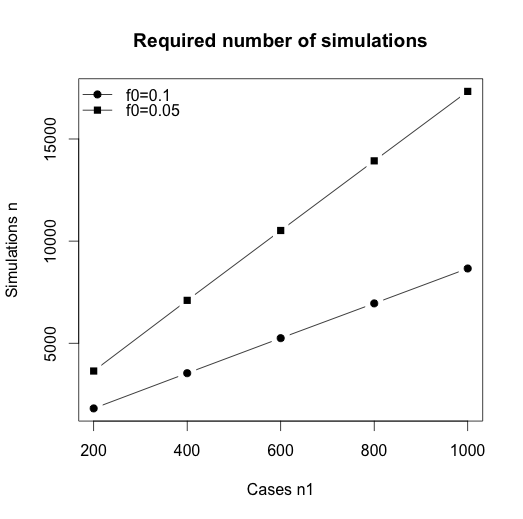

## Contents


* Quick review about hypothesis testing:
    + p values? power? 
    + detour to the replicability crisis
* Rationale behind simulations for hypothesis testing 
    + when are simulations worth bothering with?
* Permutations for estimating p values in case/control testing
    + a useful example
* Simulations for estimating empirical power in case/control testing
    + current methods
    + weighted permutations
* Application to multiple testing 
    + controlling the FWER with permutations

## What this presentation is not about

* Simulation methods are widely used in statistics, here the focus is on simulations for computing p values and power  
* For instance, we won't talk about MCMC sampling methods
* If you wonder how to sample standard distributions in R, remember the syntax is __r__ + __R name of ditribution__

```{r}
runif(1) #draws one value according to the uniform ditribution in [0,1] 
rnorm(2,mean=0,sd=2) #two values, gaussian distribution N(0,2^2)
rt(4,df=3) #four values, Student's t distribution with 2 degrees of freedom 
```
# Hypothesis testing: a quick review

##The Neyman-Pearson approach

* __Aim: __ decide whether there is enough evidence in data to reject the current hypothesis 

* __Steps:__

    1. Set up null (H0) and alternative (H1) hypothesis
    2. Calculate a test statistic $T_{obs}$ on the data
    3. Decide on the basis of $T_{obs}$ whether to reject H0 in a way that allows to <font color='Turquoise'>control the false positive rate</font> at a given threshold $\alpha$:
        + <font color = 'Magenta'>Crucial ingredient:</font> knowledge of the distribution of $T$ under H0 
        + $\Rightarrow$ the last step requires 
            + computing the probability $p$ for $T$ to be as extreme as $T_{obs}$ if H0 holds (the p value of the test)  
            + <font color='Turquoise'>rejecting H0 if $p<\alpha$</font>

## Example 

Mock methylation M-values for 50 individuals with lung cancer and 50 individuals without
```{r}
mydata=read.table('data/ex_methy.csv',sep=',',header=T); attach(mydata)
boxplot(Mvalue~Outcome)
```

## 

Is the mean value in controls $\mu_0$ the same as the mean value in cases $\mu_1$? 

1. Hypothesis:
    + H0: $\mu_0-\mu_1=0$ 
    + H1: $\mu_0 - \mu_1> 0$ (right unilateral test)
2. Statistics:
$$
T=\frac{\mu_0-\mu_1}{\sigma\sqrt{1/n_0+1/n_1}}, \mbox{ where } \sigma=\sqrt{\frac{(n_0-1)\hat{\sigma_0}^2+(n_1-1)\hat{\sigma_1}^2}{n_0+n_1-2}}
$$
Under H0, $T$ follows a Student's t-distribution with $n-2$ degrees of freedom (assuming equal variance in groups)
3. p value:
$$
p=Pr(T>T_{obs}| \mbox{H0})
$$

##

```{r}
s=sqrt((49*sd(Mvalue[Outcome==0])^2+49*sd(Mvalue[Outcome==1])^2)/98)
Tobs=(mean(Mvalue[Outcome==0])-mean(Mvalue[Outcome==1]))/s/sqrt(1/50+1/50)
p=pt(q=Tobs,df=98,lower.tail=F)
unlist(list(Tobs=Tobs,p=p))
```

```{r,echo=FALSE}
curve(dt(x,df=98),from=-7,to=7,ylab='',xlab='',lwd=2)
abline(v=Tobs,col='darkgreen',lwd=2)
polygon(c(Tobs,seq(Tobs,7,by=0.01),7),c(0,dt(seq(Tobs,7,by=0.01),df=98),0),col="beige")
text(x = 3, y= 0.05, labels = expression(p),cex=1)
legend(x='topleft', lwd=2, col=c(1,'darkgreen'),legend=c('T under H0', expression(T[obs])),bty='n')
```
_<font size=2>See the .Rmd file for this plot's code</font>_

## 
Equivalently, using the R function for Student's test:

```{r}
t.test(x=Mvalue[Outcome==0],y=Mvalue[Outcome==1],alternative='greater', var.equal=T)
```

Here $p=0.02$ $\Rightarrow$ we can reject H0 at the significance level $\alpha=0.05$ (but not at the 0.01 level...)

## Decision rules

By rejecting H0 iff $p<\alpha$ we control the type I error rate (ie the false positive rate) at the $\alpha$ level:

Let $T_\alpha$ be the $(1-\alpha)$-quantile of $T$ under H0 (the critical value) $\Rightarrow p<\alpha$ iff $T_{obs} > T_\alpha$ <font size=2>(case of right unilateral tests)</font>
$$
\begin{align}
\Rightarrow\mbox{Type I error rate }&=Pr(H0 \mbox{ rejected } | H0 \mbox{ holds })=Pr(p < \alpha | H0) \\
                         &= Pr( T_{obs} > T_\alpha | H0) = \alpha
\end{align}
$$

```{r,echo=FALSE}
curve(dt(x,df=98),from=-7,to=7,ylab='',xlab='',lwd=2)
abline(v=Tobs,col='darkgreen',lwd=2)
abline(v=qt(p=1-0.05,df=98),col='red',lwd=2)
polygon(c(qt(p=1-0.05,df=98),seq(qt(p=1-0.05,df=98),7,by=0.01),7),c(0,dt(seq(qt(p=1-0.05,df=98),7,by=0.01),df=98),0),col="Darkgray")
polygon(c(Tobs,seq(Tobs,7,by=0.01),7),c(0,dt(seq(Tobs,7,by=0.01),df=98),0),col="Beige")
text(x = 3, y= 0.05, labels = expression(p),cex=1)
text(x = 1, y= 0.05, labels = expression(alpha),cex=1)
legend(x='topleft', lwd=2, col=c(1,'darkgreen','red'),legend=c('T under H0', expression(T[obs]), expression(T[alpha])),bty='n')
```


## Misconceptions about p-values

- p value is not the probability that H0 holds given the data. For this, a prior probability of H0 is needed:
$$
Pr(H0|\mbox{data})=\frac{Pr(\mbox{data}|H0)\times Pr(H0)}{Pr(\mbox{data}|H0)\times Pr(H0)+Pr(\mbox{data}|H1)\times Pr(H1)}
$$
- An alternative to frequentist p value is Bayes factor $BF=Pr(\mbox{data}|H1)/Pr(\mbox{data}|H0)$:
$$
\frac{Pr(H1|\mbox{data})}{Pr(H0|\mbox{data})}=BF\times\frac{Pr(H1)}{Pr(H0)}
$$
- $p<\alpha$ suggests there might be something in data, it is not a proof of scientific finding. What matters is the effect size
- use p values only to test well defined hypothesis
- do not forget confidence intervals
- controversial finding: published studies with $p<\alpha$ are _often_ not replicable (wait a few slides...)

<font size=3>References</font>

- <font size=2> Nuzzo, R. (2014). Nature, 506(7487), 150-152.</font>
<!-- - <font size=2>Goodman, S. (2008). Seminars in hematology. Vol. 45, No. 3, 135-140. </font> -->
- <font size=2>Senn, S. (2001). Journal of Epidemiology and Biostatistics, 6(2), 193-204. </font>


## Statistical Power 

+------------+----------------------------+-------------------------------------------------+
|            |H0 not rejected             |H0 rejected                                      |
+------------+----------------------------+-------------------------------------------------+
|H0 true     |$1-\alpha$                  |$\alpha=$ type I error rate = significance level |
+------------+----------------------------+-------------------------------------------------+
|H0 not true |$\beta=$ type II error rate |<font color='Magenta'>$1-\beta=$ Power</font>    |
+------------+----------------------------+-------------------------------------------------+

$$
\begin{align}
\mbox{Power } &= Pr(H0 \mbox{ rejected } | H1 \mbox{ holds}) \\
              &= Pr(T > T_{\alpha}| H1 \mbox{ holds})
\end{align}
$$

henceforth:

* Power is a function of $\alpha$
* In order to compute the test power one must know <font color = 'Magenta'>the distribution of $T$ under H1</font>


## Back to the example

What is the power of our t-test to reject H0 at confidence level $\alpha=0.01$ if $\mu_0-\mu_1=0.28$ (H1)? 

\

Under H1, $T$ follows a t-distribution with non-centrality $\frac{\mu_0-\mu_1}{\sigma\sqrt{1/n_0+1/n_1}}$

```{r,echo=FALSE}
Ta=qt(p=1-0.01,df=98)
curve(dt(x,df=98),from=-7,to=7,ylab='',xlab='',lwd=2); abline(v=Ta,col='red',lwd=2)
m0=mean(Mvalue[Outcome==0]); m1=mean(Mvalue[Outcome==1])
ncp=(m0-m1)/s/sqrt(1/50+1/50)
curve(dt(x,df=98,ncp=ncp),add=TRUE,col='blue',lwd=2)
polygon(c(Ta,seq(Ta,7,by=0.01),7),c(0,dt(seq(Ta,7,by=0.01),df=98,ncp=ncp),0),col="skyblue")
polygon(c(Ta,seq(Ta,7,by=0.01),7),c(0,dt(seq(Ta,7,by=0.01),df=98),0),col="darkgray")
text(x = 1.5, y= 0.04, labels = expression(alpha),cex=1)
text(x=5,y=.04, labels=expression(1-beta),cex=1)
legend(x='topleft', lwd=2, col=c(1,'blue','red'),legend=c('T under H0', expression('T under H1'),expression(T[alpha])),bty='n')
```

##

```{r}
m0=mean(Mvalue[Outcome==0]); m1=mean(Mvalue[Outcome==1])
ncp=ncp=(m0-m1)/s/sqrt(1/50+1/50)
pw=pt(q=qt(p=1-0.01,df=98),df=98,ncp=ncp,lower.tail=FALSE)
unlist(list(Power=pw))
```

Or equivalently, using the R built-in function:

```{r}
power.t.test(n=50,delta=0.28,alternative='one.sided',type='two.sample',sig.level=0.01,sd=sd(Mvalue))
```


## The replicability crisis 

* Positive findings are often not replicable in subsequent studies (in all fields)
* This can happen when initial studies are underpowered. To see why, consider the <font color='magenta'>false-positive report probability (FPRP)</font>:

$$
\begin{align}
FPRP = Pr(H0 | p < \alpha) = & \frac{Pr(p<\alpha|H0)\times Pr(H0)}{Pr(p<\alpha|H0)\times Pr(H0)+Pr(p<\alpha|H1)\times Pr(H1)} \\
                           = & \frac{\alpha Pr(H0)}{\alpha Pr(H0) + (1-\beta) Pr(H1)}
\end{align}
$$
$\Rightarrow$ the FPRP increases for lower $\beta$s

\

\

<font size=3>References</font>

* <font size=2> Wacholder,S. (2004). J. Natl Cancer Inst. 96, 434-442</font>
* <font size=2> Goodman, S. N. (1992). Stat. Med., 11(7), 875-879.</font>


## Probability that H0 is true if test is positive

```{r,echo=FALSE,fig.height=5.5,fig.width=7}
betas=seq(0.05,1,by=0.05)
par(mfrow=c(1,2))
plot(betas,.05*.5/(.05*.5+betas*(1-.5)),type='o',pch=20,xlab=expression(beta),main='Pr(H0)=0.5',ylab='FPRP',ylim=c(0,1))
points(betas,.01*.5/(.01*.5+betas*(1-.5)),type='o',pch=20,col='red')
points(betas,.001*.5/(.001*.5+betas*(1-.5)),type='o',pch=20,col='darkgreen')
legend(x='topleft',lwd=1,col=c('black','red','darkgreen'),
       legend=c(expression(paste(alpha,' = 0.05',sep='')),
                expression(paste(alpha,' = 0.01',sep='')),
                expression(paste(alpha,' = 0.001',sep=''))),
       bty='n',pch=20)
plot(betas,.05*.8/(.05*.8+betas*(1-.8)),type='o',pch=20,xlab=expression(beta),main='Pr(H0)=0.8',ylab='FPRP',ylim=c(0,1))
points(betas,.01*.8/(.01*.8+betas*(1-.8)),type='o',pch=20,col='red')
points(betas,.001*.8/(.001*.5+betas*(1-.8)),type='o',pch=20,col='darkgreen')
legend(x='topleft',lwd=1,col=c('black','red','darkgreen'),
       legend=c(expression(paste(alpha,' = 0.05',sep='')),
                expression(paste(alpha,' = 0.01',sep='')),
                expression(paste(alpha,' = 0.001',sep=''))),
       bty='n',pch=20)
```

# Testing with simulations: an overview

## Simulations are useful when...


...the distribution of $T$ under H0 is not known (analytic derivation of its densities and CDF not possible, large sample approximations not available or not applicable) but it is possible to sample it<br> 
$\Rightarrow$ we can calculate the <font color='Magenta'>empirical p value:</font>

1. simulate $N$ realizations of $T$ under H0: 
2. estimate p with 
    $$
    \hat{p} = \frac{\#\{ \mbox{ H0 } T \mbox{ realizations }  > T_{obs}\}}{N} 
    $$
(change $>$ for bilateral and unilateral left tests...)
## and when..

...the distribution of $T$ under H1 is not known but it is possible to sample it <br>
$\Rightarrow$ we can calculate the <font color='turquoise'>empirical power:</font>

1. simulate $N$ realizations of $T$ under H1
2. estimate power with
    $$
    \hat{\mbox{power}} = \frac{\#\{ \mbox{ H1 } T \mbox{ realizations }  > T_\alpha\}}{N}
    $$
where $T_\alpha$ is the $(1-\alpha)$-quantile of $T$ under H0. If the distribution of T under H0 is not known, one can sample T under H0 and take the $(1-\alpha)$-quantile.

## Why it works

__Law of large numbers__

If $Y_1,\ldots,Y_N$ are an i.i.d. sample from distribution $G$ then
$$
\frac{1}{N}\sum_{i=1}^NY_i \xrightarrow{P} E[Y]
$$

In our case we have:

* $T_1\ldots,T_N$ are an i.i.d. sample from the distribution $G$ of $T$

* The indicator variables $\mathbb{1}_{T_1>T_{obs}},\ldots,\mathbb{1}_{T_N>T_{obs}}$ are an i.i.d. sample from a Bernoulli distribution whose expected value is the p value 

* Hence:
$$
\frac{1}{N}\sum_{i=1}^N \mathbb{1}_{T_i>T_{obs}} = \frac{\#\{ T \mbox{ realizations }  > T_{obs}\}}{N} \xrightarrow{P} p
$$


## (Silly) application to our example: empirical p 
```{r}
Tsample0=rt(10000,df=98)
em_p=mean(Tsample0>Tobs)
unlist(list(p=p, empirical_p=em_p))
```

```{r, echo=FALSE}
hist(Tsample0,main='Empirical distribution of T under H0',xlab='',freq=FALSE,ylim=c(0,.45)) 
abline(v=Tobs,col='darkgreen',lwd=2)
curve(dt(x,df=98),add=TRUE,from=min(Tsample0),to=max(Tsample0),lty=2)
legend(x='topleft',lwd=2:1,legend=c(expression(T[obs]),'real dist'),col=c('darkgreen','black'),lty=1:2,bty='n')
```


## (Silly) application: empirical power 
```{r}
Tsample1=rt(10000,df=98,ncp=ncp)
Ta_em=quantile(Tsample0,probs=1-0.01)
em_pw=mean(Tsample1>Ta_em)
unlist(list(power=pw, empirical_power=em_pw))
```

```{r,echo=FALSE}
hist(Tsample1,main='Empirical distribution of T under H1',xlab='',freq=FALSE,ylim=c(0,.45))
abline(v=Ta_em,col='red',lwd=2)
curve(dt(x,df=98,ncp=ncp),add=TRUE,from=min(Tsample1),to=max(Tsample1),lty=2)
legend(x='topleft',lwd=2:1,legend=c(expression(T[alpha]),'real dist'),col=c('red','black'),lty=1:2,bty='n')
```


## Data replicates

Simulations are particularly useful for non-parametric tests ($\neq$ previous example). <br> 

In this case, drawing a sample of the statistic under a given hypothesis requires two steps (Monte Carlo simulations):

- simulate <font color='magenta'>$N$ data replicates</font> according to the hypothesis
- for each replicate $i$, calculate the statistic realization $T_i$ 

Then p value and power are estimated as above.


## Focus on permutation-like methods

In the following we focus on ways of generating data replicates for testing whether two groups (eg cases vs controls) are the same:

1. Empirical p values through <font color='turquoise'>permutations</font> (classic) 
2. Empirical power through
    + Monte Carlo simulations (classic)
    + <font color='turquoise'>Weighted permutations</font> (more original)

# Simulations for case/control testing: empirical p values


## Empirical p values trhough permutations 

* Suppose we have observations $x_1,\ldots,x_{n_0}\sim F_1$ for controls and observations $y_1,\ldots,y_{n_1}\sim F_2$ for cases
* We want to test 
$$
\mbox{H0: } F_1=F_2\; \mbox{ versus }\; \mbox{ H1: }F_1\neq F_2
$$
(case-control association can be seen as a particular case)
* Let $T$ be our statistics, eg $T=|\bar{x}-\bar{y}|$

<font color='magenta'>Key fact:</font> H0 is equivalent to say that _the observations are independent from the case/control status_<br>
$\Rightarrow$ we can sample the data distribution under H0 simply by <font color='turquoise'>shuffling the case control status:</font> each permutation is a data replicate 

## Example

Back to the Mvalue example with $T=\bar{M}_{controls}-\bar{M}_{cases}$


<center>

</center>


## 

```{r}
tobs=abs(mean(Mvalue[Outcome==0])-mean(Mvalue[Outcome==1]))
one.perm=function(x,y){
  perm=sample(x)
  abs(mean(y[perm==0])-mean(y[perm==1]))
}
N=10000
t=replicate(N, one.perm(Outcome,Mvalue))
pp=mean(t>tobs)
unlist(list(p_permutation=pp))
```
```{r,echo=FALSE,fig.width=3,fig.height=3}
hist(t,freq=FALSE,main='Emp. distr. of T, H0')
abline(v=tobs,col='darkgreen',lwd=2)
```


## Remarks

* Which N? We can compute a CI for p in the usual way:
```{r}
c(pp-1.96*sqrt(p*(1-p)/N),pp+1.96*sqrt(p*(1-p)/N))
```
* Be careful that the smallest possible p is $1/N$ $\Rightarrow$ $N$ must be very large in multiple testing
* Useful strategy: start with relatively small $N$ and increase to large numbers only if p is small and you need more precision  
* It is a good idea to store all data replicates in a data frame, one replicate per column and then use, 
```{r, eval=FALSE}
apply(replicates,2,function_for_stat)
```
* Important for the following: permutations preserve the fixed number of cases and controls!

## A more interesting application: minimum p value

* Suppose we want to test case/control association with a block of 10 SNPs. 
* We can start by doing a Fisher exact test for each individual SNP, resulting in a p value $p_i$, and then we take the min p value as our statistic:
$$
T=\min_{j=1,\ldots,10} p_j
$$
* We need to know the distribution of this statistic if we want to calculate a global p value! 
* This is not a standard distribution, so we turn to permutations 


## Example

Mock genotypic data for 10 SNPs, 250 cases and 250 controls

<center>

</center>

##

We load the data
```{r}
load('data/ex_snps.Rda')
head(cbind(pheno,geno))
```

We calculate p values $p_{obs,j}$ for individual SNPs and compute $T_{obs}=\min_{j=1,\ldots,10} p_{obs,j}$
```{r}
pvalues_obs=c(NA,10)
for(snp in 1:10) pvalues_obs[snp]=fisher.test(pheno,geno[,snp])$p
```

##
We calculate p values $p_j$ for each permutation $r$ and compute $T^r=\min_{j=1,\ldots,10} p^r_j$
```{r,eval=TRUE}
T_obs=min(pvalues_obs)
replicates0=matrix(NA,nrow=500,ncol=1000) #stores one permutation per column for later use
pvalues0=matrix(NA,nrow=10,ncol=1000) #stores the SNP p values in columns, one per replicate
for(repl in 1:1000){ 
  perm=sample(pheno)
  replicates0[,repl]=perm
  for(snp in 1:10){
  pvalues0[snp,repl]=fisher.test(perm,geno[,snp])$p
  }
}
T_sample0=apply(pvalues0,2,min)  
```
At last we calculate the empirical p value for $T$ as 
$$
\frac{\# \{T^r < T_{obs}\}}{\# \mbox{ replicates}}
$$
```{r,eval=TRUE}
mean(T_sample0<T_obs)
```


# Simulations for case/control testing: empirical power

## Empirical power with a focus on large scale association studies


- Apart from a few simple situations (eg  t-test, $\chi^2$-test...), the distribution of the test statistics $T$ under H1 is not known, neither exactly nor asymptotically
- This is typical of multi markers methods for GWAS and other large scale genetic studies
- In these cases power is usually estimated by analysing many data replicates under H1
- In association studies H1 is the assumption of a <font color='magenta'>disease model</font> ie a penetrance function
- In symbols:
    + $n_1=$ number of cases, $n_0$ number of controls, $n=n_0+n_1$ 
    + $X^j_i=$ genotype of individual $i$ for market $j$
    + $Y_i=$ phenotype (case/control) of $i$
    + H1: penetrance function <font color='magenta'>$\pi_i=Pr(Y_i=1|X_i)$</font> 

## Which simulations under H1?

* Important constraint: simulations should all preserve the fixed number of cases and control

* Naif protocol:
    + draw individual phenotypes given their real genotypes by sampling $Y_i|X_i\sim\mathcal{B}(\pi_i)$
    + Problem: $\pi_i$ is small $\Rightarrow$ we end up with very few cases!
    
* Two alternative approaches:

    1. Simulation of both genotypes and phenotypes for a very large population:
        + Simulate $m$ genotypic datasets, with $m>>n$
        + For each individual of this large population draw $Y_i|X_i$ as above
        + Hope that $m$ is large enough to have enough cases
    2. Simulation of genotypes given fixed phenotypes: $X_i|Y_i$ has a multinomial distribution with parameter $\propto \pi_i\times Pr(X_i)$. Approach implemented in HAPGEN <font size='3'>[Zu, S. (2011). Bioinformatics, 27(16), 2304-2305]</font>
    
    
* Common problem: a genotypic model is needed! Not a problem for independent markers but what about mimicking LD patterns?


## Problems with first approach (i)

Slow, requires a lot of memory 

<center>

</center>

<font size=2>Ref: Alarcon, F. and Perduca, V. Work in progress</font>


## Problems with first approach (ii)

Attention: raising the disease prevalence is not an option as this will bias the power estimates

<center>

</center>

<font size=2>Ref: Perduca, V. (2012). Hum Hered, 73:95-104.</font>


## A possible solution: weighted permutations

* __waffect__ is a recently introduced algorithm that affects the phenotype of each individual 
    + conditionally on genotype
    + according to the fixed disease model
    + in a way that preserves the fixed number of cases
* Advantages:
    + fast, only phenotypes are simulated
    + one can use original genotypic datasets
    + R package available
    + One simple function, only input are the probabilities $\pi_i$
    
<font size=2>Ref: Perduca, V. (2012). Hum Hered, 73:95-104.</font>

## How it works

* waffect is based on a Belief Propagation algorithm for a simple HMM-like graphical model
* idea is to sample recursively phenotypes. Let $Z_i$ the number of cases affected for individuals $1,\ldots,i$, then the steps are 
    + draw $Y_1$ conditionally on the fixed total number of cases $Z_n=n_1$
    + draw $Y_2$ conditionnally on $Z_1$ and $Z_n=n_1$
    + drawn $Y_3$ conditionally on $Z_2$ and $Z_n=n_1$
    + etc
    
<center>

</center>

## Example

* We calculate the empirical power of the test looking for a signal in the 10 SNPs by simulating phenotypes under H1 using waffect
* Fr H1 we take an additive disease model with prevalence $f_0=0.1$ and OR $=1.6$ on SNP 8: 
$$
\pi_i= \frac{1}{1+\exp(-\log(f_0)-\log(OR)\times snp_8)}
$$
* Recall that 
    + $T=\min_{j=1,\ldots,10} p_j$
    + $\hat{\mbox{power}} = \frac{\#\{ \mbox{ H1 } T \mbox{ realizations }  > T_\alpha\}}{N}$.  

We first define a disease model for H1 and calculate $T_\alpha$ using the sample of $T$ under H0 previously calculated
```{r,eval=TRUE}
pi=1/(1+exp(-log(0.1)-log(1.6)*geno[,8]))
threshold=quantile(T_sample0,probs=0.05)
```

##

We use waffect to simulate replicates with 250 cases and 250 controls according to $\pi_i$

```{r,message=FALSE,eval=TRUE,warning=FALSE}
require(waffect)
pvalues1=matrix(NA,nrow=10,ncol=1000) #stores the SNP p values in columns, one per replicate
for(repl in 1:1000){ 
  wperm=waffect(prob=pi,count=250,label=c(1,0))
  for(snp in 1:10){
    pvalues1[snp,repl]=fisher.test(wperm,geno[,snp])$p
  }
}
T_sample1=apply(pvalues1,2,min)  
```

We estimate the power
```{r,eval=TRUE}
mean(T_sample1<threshold)
```


# Applications to the multiple testing problem

## Family Wise Error Rate

* Standard individual marker approaches for GWAS consist in testing for each SNP 
$$
\mbox{H0}_j: \mbox{ SNP}_j \mbox{ not associated vs H1}_j: \mbox{SNP}_j \mbox{ associated  } 
$$
* If there are $p$ SNPs and each test is done at threshold $\alpha$, expect $p\times \alpha$ false positives (type I errors) when no SNP is associated. Eg $p=10^6$ and $\alpha=0.05 \Rightarrow$ in average 50000 false positives!

\

* The <font color='magenta'>Family Wise Error Rate (FWER)</font> is the probability of having at least one false positive when H0 is true for all $p$ tests.

* If all tests are independent (not realistic because of LD):
$$
FWER = Pr(\exists ~1 \leq j \leq p \mbox{ s.t. } H0_{j} \mbox{ rejected } | \forall~ j\, H0_{j} \mbox{ holds})  = 1-(1-\alpha)^p
$$
* If the test are dependent: FWER $<1-(1-\alpha)^p$ 
* We avoid type I error rate inflation by doing each test at a level $\alpha$ such that the FWER is $\leq \alpha'$ where $\alpha'$ is a fixed threshold, for instance $\alpha'=0.05$ 

## Bonferroni correction

If there are $p$ SNPs, do each test at the threshold
$$
\alpha=\frac{\alpha'}{p},
$$
then FWER $\leq \alpha$.

\

__Proof.__

$$
\begin{align}
\mbox{FWER} & = Pr(\bigcup_{j=1}^p(H0_j \mbox{ rejected }|H0_j \mbox{ holds})\\
            & \leq \sum_{j=1}^p Pr(H0_j \mbox{ rejected }|H0_j \mbox{ holds}) \\
            & = \sum_{j=1}^p \frac{\alpha'}{p} \\
            & = \alpha'.
\end{align}
$$

## The problem with Bonferroni correction

* $\frac{\alpha'}{p}$ is very small $\Rightarrow$ power loss

* Loss in power is even more important if tests are dependent: if there are only $q$ truly independent tests out of $p$, ideally one would need to take 
$$
\frac{\alpha'}{q} > \frac{\alpha'}{p}
$$


## Example: independent SNPs

* The SNPs in the previous datasets are independent 
* To estimate the FWER we use the previously generated data replicates under H0 
* For each replicate, we count a false positive if at least one p value is $<$ 0.005 ie if their min is $<0.05$
* We show that if we test each SNP at the threshold 
$$
\alpha=\frac{\alpha'}{p}=\frac{0.05}{10}=0.005,
$$  
the FWER estimate is $0.05$

```{r,eval=TRUE}
mean(apply(pvalues0,2,min)<0.05/10)
```

## Example: correlated SNPs

Same analysis with 10 correlated SNPs:
```{r,message=FALSE,fig.width=4,fig.height=3,warning=FALSE}
load('data/ex_snps_d.Rda')
require(corrplot); corrplot(corr=cor(geno_d),method='square',type='upper',tl.pos='n')
```

## 


```{r,eval=TRUE}
pvalues0_d=matrix(NA,nrow=10,ncol=1000) #stores the SNP p values in columns, one per replicate
for(repl in 1:1000){ 
  perm=sample(pheno)
  for(SNP in 1:10){
    pvalues0_d[SNP,repl]=fisher.test(perm,geno_d[,SNP])$p
  }
}
T_sample0_d=apply(pvalues0_d,2,min) 
```

This time the FWER estimate is lower than $\alpha'=0.05$:

```{r,eval=TRUE}
mean(apply(pvalues0_d,2,min)<0.05/10)
```


## Several approaches to overcome the problem
* Several methods have been proposed to choose $q$:
    + $q=$ number of LD blocks
    + eigenvalues  of the correlation matrix of the SNP allele counts
    
* Several studies based on HapMap data suggested a threshold of $5\times 10^{-8}$ for European studies

* In the following we discuss an alternative based on permutations

\ 

<font size=2>Ref. Sham, P. C. (2014). Nat. Rev. Genet, 15(5), 335-346. </font>


## Permutation procedure for FWER control

* Obtain the empirical distribution of $T=\min_{j=1,\ldots,10} p_j$: 

<center>

</center>

* Take the $\alpha'$-quantile <font color='magenta'>$T_{\alpha'}$</font> 
* <font color='magenta'>Test each SNP at the threshold $T_{\alpha'}$</font>


## Why it works

__Proof.__
$$
\begin{align}
FWER & = Pr_{H0}(\exists j \mbox{ s.t. } H0_{j} \mbox{ rejected })  \\
      & = Pr_{H0}(\exists j \mbox{ s.t. } p_{obs,j}< T_{\alpha'}) \\
      & = Pr_{H0}(\min_j p_{obs,j} < T_\alpha') \\
      & = Pr_{H0}(T<T_{\alpha'})=\alpha'.
\end{align}
$$

\

\

Equivalently, define for each SNP $j$ the <font color='turquoise'>empirical adjusted p value</font>
$$
p^{adj}_j=\frac{r+1}{N+1}
$$
where $r$ is the number of $T^r$ smaller than $p_{obs,j}$, and <font color='turquoise'>reject H0$_j$ if $p^{adj}_j<\alpha'$</font>


## Example: back to the 10 correlated SNPs

We compute $T_{\alpha'}$ 
```{r,eval=TRUE}
Tap=quantile(T_sample0_d,probs = 0.05)
unlist(list(threshold_perm=Tap))
```

The estimate of the FWER is $\alpha'=0.05$
```{r,eval=TRUE}
mean(apply(pvalues0_d,2,min)<Tap)
```


